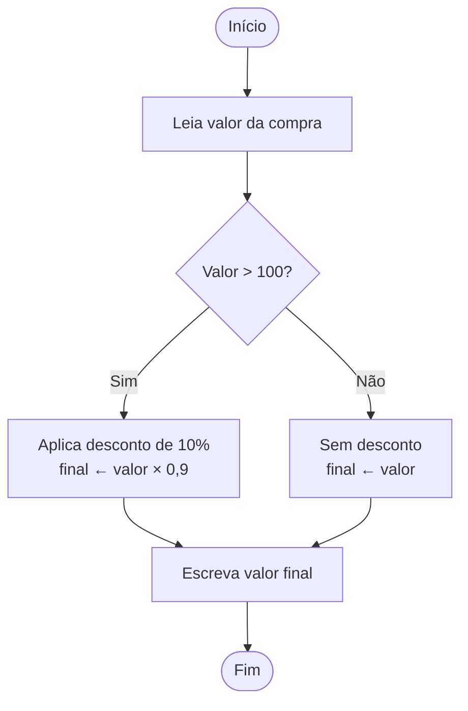

# Fluxograma — Desconto na loja (Mermaid)

**Problema:** Uma loja dá desconto de 10% para compras acima de R$ 100. Leia o valor da compra e mostre o valor final a pagar.



---

## Pseudocódigo correspondente

```
Início
    Declare valor, final: real

    Leia valor

    Se valor > 100 então
        final ← valor × 0,9
    Senão
        final ← valor

    Escreva final
Fim
```